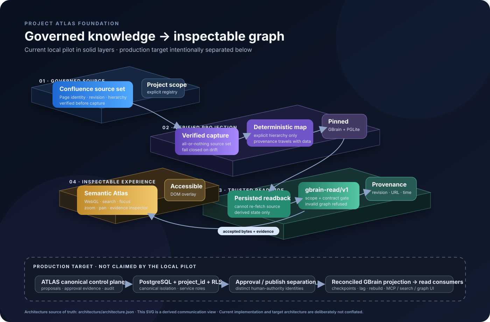

# Project ATLAS Foundation

**A provenance-first, fail-closed foundation for turning governed knowledge into an inspectable graph experience.**

Project ATLAS demonstrates a practical answer to a difficult AI knowledge problem: **how do you make derived knowledge useful without losing track of scope, source, evidence and authority?**

Instead of treating a graph projection as a new source of truth, ATLAS keeps the source boundary explicit, carries provenance through the projection path, validates project scope and graph contracts, and refuses invalid state rather than quietly substituting plausible-looking data.

<p align="center">
  
</p>

> **Current maturity:** the repository contains an implemented **local end-to-end pilot and WebGL graph workspace**. The production ATLAS control plane described in the architecture is a **target state**, not a production-readiness claim.

## Why this exists

Knowledge graphs become dangerous when the picture looks more certain than the evidence behind it.

ATLAS is designed around the opposite principle: a useful graph should make it easier to answer **where did this come from, what scope does it belong to, and what do we actually know?**

That creates value for teams building AI agents, enterprise search, governed retrieval, knowledge platforms or evidence-sensitive graph products:

- **Trace the graph back to source evidence.** Source page identity, revision, URL and capture metadata survive the local projection path and can be inspected in the UI.
- **Keep project scope executable.** Unknown, ambiguous and cross-project combinations are denied by contract rather than accepted by convention.
- **Separate canonical knowledge from derived retrieval.** GBrain is a pinned, rebuildable projection in the pilot — useful, replaceable and explicitly non-canonical.
- **Prefer refusal to fabricated confidence.** Invalid snapshots, torn artifacts, unavailable rendering and missing provenance become visible failures instead of demo data or invented relations.
- **Reproduce what happened.** Stable inputs produce deterministic projection/read artifacts, making evidence, debugging and regression analysis easier.
- **Explore the graph without sacrificing accessibility.** The Semantic Atlas uses WebGL for rendering while keyboard and assistive-technology semantics live in DOM controls derived from the same projected scene.

## Try the Semantic Atlas

The fastest path uses the **committed accepted ATLAS-65 evidence**. It does not require Confluence credentials or a fresh pipeline run.

```bash
git clone https://github.com/DYAI2025/project-atlas-foundation.git
cd project-atlas-foundation
npm ci
npm run atlas39:serve
```

Open:

```text
http://127.0.0.1:4339/
```

You can then:

- navigate the projected source hierarchy;
- search nodes;
- focus a node and inspect its evidence;
- zoom and pan the WebGL stage;
- use keyboard-operable graph controls;
- see explicit failure states if accepted graph data or rendering is unavailable.

The viewer does **not** fall back to a fixture or demo graph when the accepted snapshot cannot be used.

## What the current pilot proves

The implemented local path is deliberately narrow but real:

```text
Declared Confluence source set
        │
        ▼
Verified live capture + project scope
        │
        ▼
Deterministic projection
        │
        ▼
Pinned GBrain + local PGLite
        │
        ▼
Persisted readback only
        │
        ├──────────────► provenance sidecar
        ▼
gbrain-read/v1 + scope validation
        │
        ▼
Validate-then-serve
        │
        ▼
Semantic Atlas WebGL workspace
```

Key implementation areas:

| Area | Purpose |
|---|---|
| `src/atlas65/` | Live source capture, projection, pinned GBrain integration and persisted snapshot construction |
| `src/gbrain-read-contract/` | Fail-closed graph and project-scope contract validation |
| `src/local-contract/` | Deterministic local adapter contract checker |
| `src/registry/` + `config/project-registry.json` | Explicit project identity and writer/scope resolution |
| `viewer/atlas39/` | Semantic Atlas workspace, WebGL graph stage, search, navigation and evidence inspection |
| `contracts/` | Versioned machine-readable boundaries |
| `docs/evidence/atlas-65/` | Accepted pilot evidence used by the no-credential viewer path |
| `architecture/` | Architecture decisions, boundaries and the canonical current/target visualization model |
| `test/` | Contract, repository, viewer, architecture and regression tests |

## Trust model

ATLAS is intentionally opinionated about evidence boundaries.

### The source remains the source

For the current pilot, the selected Confluence content is the governed source input. GBrain is a **derived projection**, not the canonical ATLAS write store.

### Provenance is data, not decoration

The projection carries source metadata forward. Snapshot construction uses persisted readback, and the evidence layer is exposed to the viewer instead of being discarded after ingestion.

### Explicit relations beat impressive inference

The accepted pilot snapshot materializes verified Confluence hierarchy relations. Other relations that may appear in a derived runtime are not silently promoted to source-backed edges.

### Failure must look like failure

The pipeline and viewer use explicit failure codes/states. Missing or invalid evidence is never replaced with a success-looking graph.

## Current architecture vs. production target

The distinction matters.

### Implemented today — local pilot

- bounded real-source Confluence capture;
- explicit project resolution;
- pinned GBrain with local PGLite persistence;
- deterministic page/link projection;
- persisted-state readback;
- `gbrain-read/v1` validation;
- provenance sidecar;
- validate-then-serve local path;
- WebGL Semantic Atlas with search, focus, zoom and pan;
- accessible DOM interaction layer;
- automated repository and secret-scan gates.

### Target architecture — not yet established by this pilot

- ATLAS-owned canonical production control plane;
- PostgreSQL canonical persistence with `project_id` and RLS;
- production service-role isolation;
- technically separated approval and publication identities;
- production projection checkpoints, lag measurement and reconciliation;
- VPS/runtime deployment evidence;
- production-scale and multi-project performance evidence.

See [`architecture/architecture.json`](architecture/architecture.json) for the canonical current/target model. The isometric diagram above and [`architecture/atlas-fireworks-spec.json`](architecture/atlas-fireworks-spec.json) are derived communication views.

## Run the full local pilot

The credentialed ATLAS-65 path performs live source capture before projection:

```bash
npm run atlas65:setup
npm run atlas65:fetch
npm run atlas65:import
npm run atlas65:snapshot
npm run atlas65:serve
```

Or run the full deterministic evidence path:

```bash
npm run atlas65:e2e
```

Requirements and explicit failure modes are documented in [`docs/atlas-65-local-e2e.md`](docs/atlas-65-local-e2e.md).

## Validate the repository

Node.js `>=22` is required.

```bash
npm ci
npm test
npm run check
```

The CI path exercises the full Node test suite and repository-consistency validation. A separate secret-scan workflow verifies reachable Git history rather than checking only the current working tree.

## Who this is for

Project ATLAS is worth exploring if you are working on:

- governed AI/agent knowledge systems;
- provenance-aware enterprise search;
- knowledge graphs where evidence quality matters;
- project-scoped retrieval and read contracts;
- human approval boundaries for AI-assisted knowledge workflows;
- graph interfaces that need to remain auditable and accessible;
- reference architectures for separating canonical knowledge from derived AI infrastructure.

It is **not currently a turnkey hosted product** or evidence of production-scale multi-tenant isolation.

## Repository evidence and design notes

Start here if you want to go deeper:

- [`docs/repository-audit-and-value-brief.md`](docs/repository-audit-and-value-brief.md) — evidence-based assessment, customer value and current gaps
- [`docs/atlas-65-local-e2e.md`](docs/atlas-65-local-e2e.md) — real-source pilot runbook and failure codes
- [`docs/atlas-39-workspace-shell.md`](docs/atlas-39-workspace-shell.md) — workspace structure, interaction model and accessibility
- [`docs/atlas-40-webgl-renderer.md`](docs/atlas-40-webgl-renderer.md) — WebGL rendering boundary, navigation behavior, deterministic views, the versioned saved-view contract and the derived edge legend
- [`architecture/architecture.json`](architecture/architecture.json) — canonical as-built / target architecture model
- [`architecture/adr/ADR-0001-canonical-store-and-gbrain-projection.md`](architecture/adr/ADR-0001-canonical-store-and-gbrain-projection.md) — canonical-vs-derived architecture decision
- [`docs/repository-assessment.md`](docs/repository-assessment.md) — upstream and legacy repository assessment

## Licensing status

This repository is publicly visible, but no root `LICENSE` or `LICENSE.md` is currently provided. **Public visibility is not the same as an open-source license.**

You can inspect and run the repository as permitted by GitHub and applicable law, but reuse or redistribution rights should not be inferred until the repository owner publishes an explicit license decision.

## Related repositories

- `DYAI2025/gbrain-atlas` — legacy prototype retained as a read-only reference; its history was not migrated into this foundation.
- `DYAI2025/Gbrain-vps` — deprecated, non-canonical artifact snapshot.

---

**Project ATLAS favors evidence over appearance:** if the system cannot establish scope, source or validity, the correct result is a visible refusal — not a more convincing graph.
